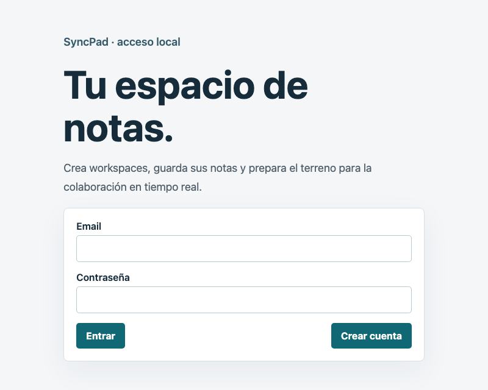
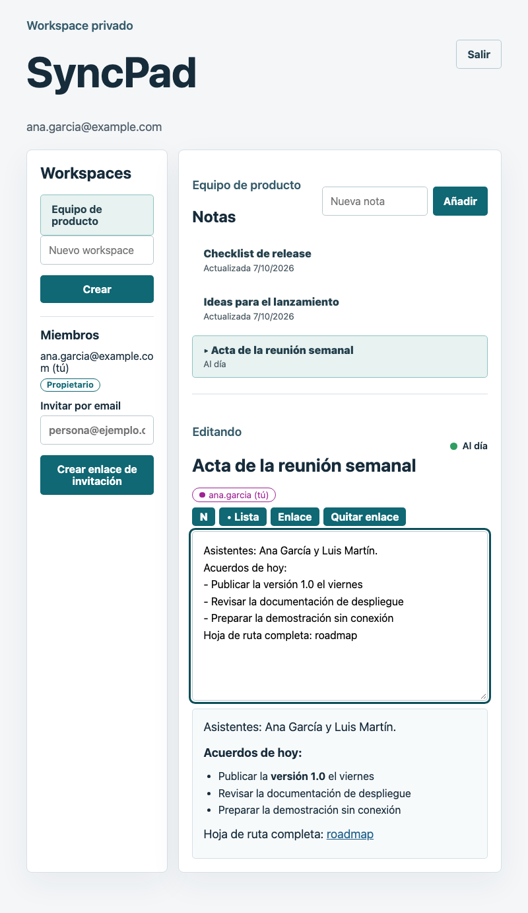
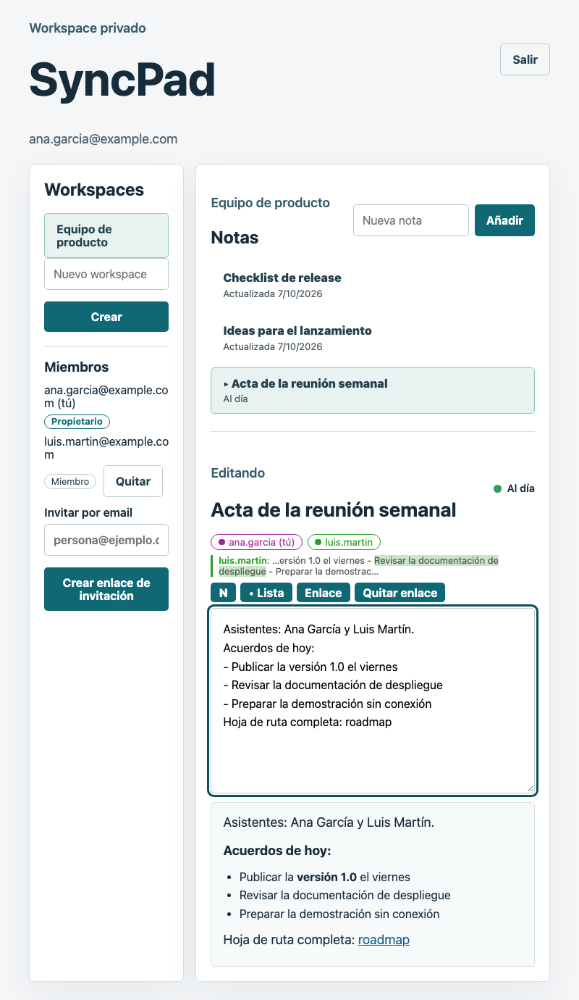
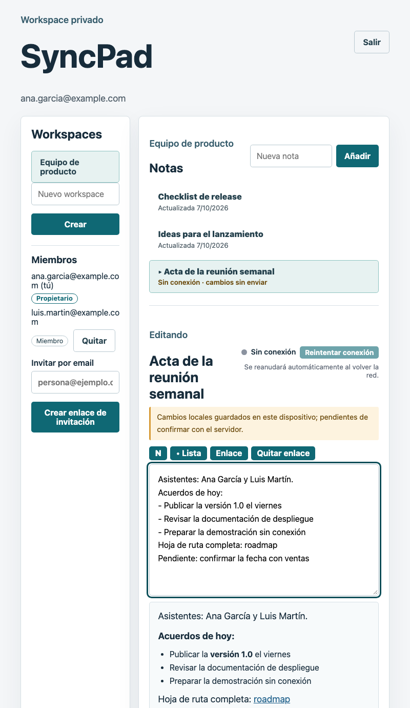
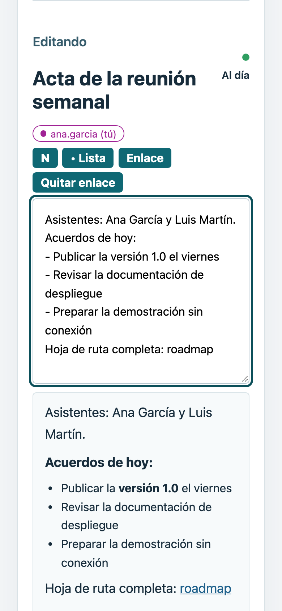
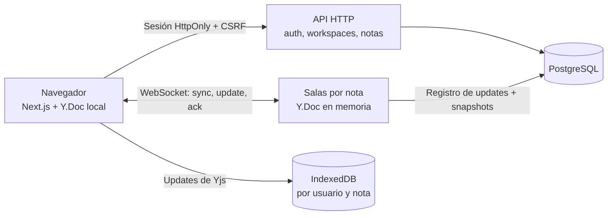

<div align="center">

# SyncPad

**Notas colaborativas que se editan entre varias personas y siguen funcionando sin conexión.**


[Probarlo](#probarlo-en-un-comando) · [Capturas](#capturas) · [Arquitectura](#arquitectura) · [Limitaciones](#limitaciones-conocidas) · [Documentación](#documentación)

</div>

SyncPad es un editor de notas en tiempo real construido sobre un CRDT (Yjs). Demuestra que varias réplicas pueden editar la misma nota, también sin red, y converger al mismo texto sin perder el trabajo de nadie.

## Qué incluye

- **Edición simultánea** de una nota entre varias personas, con presencia y cursores de los demás.
- **Modo sin conexión**: cada cambio se guarda en IndexedDB y se sincroniza al reconectar, con el estado visible («Pendiente», «Guardado»).
- **Convergencia garantizada** por Yjs: las ramas divergentes se fusionan sin elegir un ganador, y deshacer solo afecta a las ediciones propias.
- **Cuentas, workspaces e invitaciones** con permisos comprobados en el servidor, también para conexiones WebSocket ya abiertas.
- **Texto con formato acotado** (negrita, enlaces y listas); el servidor rechaza cualquier otra marca.
- **Pila completa en un comando** con Docker Compose: PostgreSQL, servidor de sincronización y web.

## Probarlo en un comando

> [!NOTE]
> Todavía no hay demo pública: el despliegue gratuito (Render + Neon) está preparado y ensayado en local, pero falta crear las cuentas y publicarlo ([`docs/deployment.md`](docs/deployment.md)). Mientras tanto se ejecuta en local.

```sh
docker compose up --build   # y abrir http://127.0.0.1:3000
```

Necesita Docker. Abre la web con `127.0.0.1` y no con `localhost`, porque el servidor solo acepta ese origen. El [guion de demo](docs/demo-script.md) recorre el flujo completo con dos navegadores.

## Capturas

Todas usan los mismos datos de ejemplo: Ana García y Luis Martín editan notas en el workspace «Equipo de producto».

| | |
| --- | --- |
| **Acceso**<br> | **Notas del workspace**<br> |
| **Edición colaborativa**<br> | **Sin conexión**<br> |
| **Móvil**<br> | |

Se regeneran con datos sembrados en una base de datos desechable:

```sh
npm --prefix e2e run screenshots
```

## Arquitectura



- **Navegador**: un `<textarea>` enlazado a un `Y.Doc`; cada edición se guarda en IndexedDB antes de enviarse, y un service worker cubre solo el shell anónimo.
- **Servidor**: HTTP para cuentas y permisos, y una sala WebSocket por nota con cola serializada y límites de tamaño y frecuencia.
- **PostgreSQL**: el registro de updates es la fuente de verdad; los snapshots (uno cada 100 updates) solo aceleran la carga.

Más detalle en [`docs/architecture.md`](docs/architecture.md).

## Decisiones de diseño

| Decisión | Por qué | Coste |
| --- | --- | --- |
| **Yjs (CRDT)** en vez de transformación operacional o «último gana» | Las ediciones offline convergen sin servidor que ordene y no se pierde trabajo | El historial crece y el formato por bloques exigiría un esquema v2 |
| **Registro de updates con `ack`** en vez de guardar solo el documento final | «Guardado» significa guardado; las reconexiones son baratas e idempotentes | Cada cambio es una escritura; los snapshots se añaden aparte para cargar rápido |
| **IndexedDB nativo** en vez de `y-indexeddb` | Los errores de apertura y lectura se pueden manejar y no hay promesas colgadas | Código propio que mantener y sin compactación en el cliente |
| **Service worker solo para el shell anónimo** en vez de cachear la aplicación entera | El caché del navegador no puede filtrar datos de una cuenta | La primera visita siempre necesita red |
| **Datos locales por usuario y sin cifrar** en vez de borrarlos al cerrar sesión | Se recupera el trabajo sin conexión y las cuentas no se mezclan | No protege frente a quien tenga acceso al perfil del navegador |
| **Rich text como atributos de `Y.Text`** en vez de un árbol ProseMirror | Evita subir el esquema a v2 y rehacer deshacer y persistencia | Sin títulos, tablas ni otros bloques |

## Limitaciones conocidas

- **Una sola instancia del servidor**: las salas viven en memoria de un proceso. No hay escalado horizontal ni prueba con varias instancias.
- **Rendimiento con muchos editores**: con 1 editor × 50 ediciones el p95 es de unos 240 ms (presupuesto: 250 ms); con 5 y 10 editores se supera. Medido con almacén en memoria en un Apple M4 Pro, no contra PostgreSQL desplegado ([#50](docs/issues/050-benchmark.md)).
- **Sin cifrado en reposo** de la copia local ni compactación del IndexedDB en el cliente.
- **Sin CSP ni cabeceras de seguridad HTTP**; se asume que las añade el proxy de despliegue.
- **Accesibilidad revisada con el árbol de Playwright**, no con VoiceOver, NVDA ni axe-core. El tema oscuro y el zoom no se han revisado.
- **Sin despliegue real ni release**: no hay URL pública, así que HTTPS, WSS, la cookie `Secure` y el arranque en frío del plan gratuito (~1 min) se han ensayado solo en local; la `v1.0.0` está pendiente de publicarlo.
- **Plan gratuito**: una instancia que se duerme a los 15 min sin tráfico y una base de 0,5 GB; es un despliegue de exposición, no de producción.

El seguimiento está en las [issues del repositorio](https://github.com/Cosmichomeless/SyncPad/issues). Lo que no figura aquí o allí no se promete.

## Calidad

- **Pruebas unitarias y de componentes**: 146 en el backend, 36 en `shared/`, 161 en el frontend y 2 del entrypoint compilado.
- **Integración con PostgreSQL y WebSocket**: 18 pruebas sobre una base de datos nueva por prueba (migraciones, permisos, borrado, reinicio, reconstrucción y copia de seguridad restaurada).
- **End-to-end**: 17 pruebas Playwright (Chromium) con tres clientes y reinicio del servidor. **No se ejecutan en CI**: se lanzan en local con `cd e2e && npx playwright test`.
- **Humo**: `sh scripts/smoke.sh` levanta el stack y ejecuta 8 comprobaciones con dos clientes sincronizando una nota; `scripts/smoke-public.mts <url>` repite el recorrido contra una URL pública (10 comprobaciones, incluida la cookie `Secure`).
- **CI** en GitHub Actions: `frontend.yml` (lint, tipos, pruebas, build) y `backend.yml` (lint, tipos, pruebas, migraciones, integración y un job `image` que construye el contenedor y repite la edición entre dos clientes, y un job `deploy-image` que hace lo mismo con la imagen de un solo origen que se despliega). Las comprobaciones estáticas y unitarias se lanzan en local con `bash scripts/check.sh`.

## Documentación

| Documento | Contenido |
| --- | --- |
| [`docs/architecture.md`](docs/architecture.md) | Componentes, protocolo, modelo de datos, seguridad y límites |
| [`docs/development.md`](docs/development.md) | Desarrollo local, comandos y notas por issue |
| [`docs/deployment.md`](docs/deployment.md) | Hosting elegido, cuotas, HTTPS y secretos, copias, despliegue paso a paso y recuperación |
| [`docs/demo-script.md`](docs/demo-script.md) | Guion para recorrer el producto con dos navegadores |
| [`docs/issues/`](docs/issues/README.md) | Un documento por issue: objetivo, decisiones, verificación y límites |
| [`.env.example`](.env.example) | Variables de entorno con sus valores locales |

## Estructura

```text
backend/    Servidor Node.js (HTTP + WebSocket) y migraciones SQL
frontend/   Next.js: editor, cliente de sincronización, IndexedDB y service worker
shared/     Contratos comunes: esquema de documento v1 y política de rich text
e2e/        Pruebas Playwright y generador de las capturas
scripts/    check.sh, smoke.sh y smoke-stack.mts (humo local y de CI), smoke-public.mts (humo de la URL pública), backup.sh y restore.sh
deploy/     Imagen única (web + API + Caddy) para el hosting gratuito
render.yaml Blueprint de Render
docs/       Arquitectura, guion de demo, desarrollo, capturas y una nota por issue
.github/    Workflows de CI del frontend y del backend
docker-compose.yml   PostgreSQL + servidor + web
```

## Despliegue

- **Existe**: `backend/Dockerfile`, `frontend/Dockerfile` y `docker-compose.yml` para la pila completa, y el humo `scripts/smoke.sh` contra una instancia en marcha.
- **Preparado y ensayado en local**: `deploy/Dockerfile` (un solo origen: Caddy delante de Next.js y del servidor), `render.yaml`, copias con `scripts/backup.sh` y `restore.sh`, y el humo `scripts/smoke-public.mts`. Plan: Render (gratis) + Neon (gratis); ver [`docs/deployment.md`](docs/deployment.md).
- **No existe**: ninguna instancia pública ni release; HTTPS, WSS y el arranque en frío solo se pueden comprobar sobre la URL real.

## Licencia

[MIT](LICENSE) © 2026 David Rodríguez
