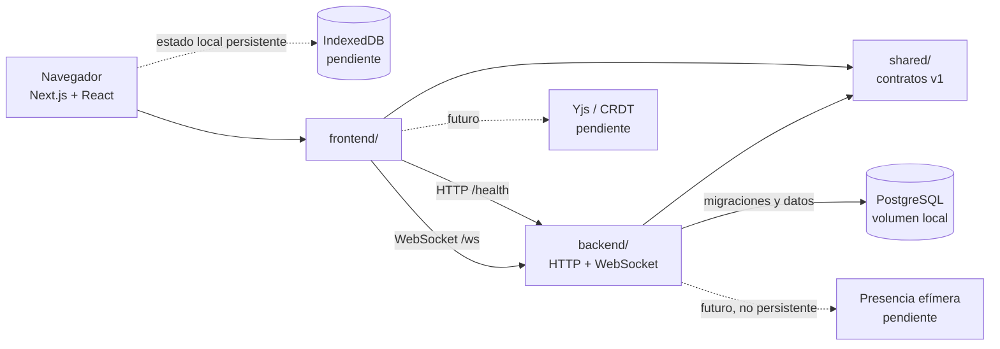

# Arquitectura de SyncPad

## Estado actual

SyncPad está dividido en un frontend Next.js y un servidor Node.js independiente.
Ambos se ejecutan localmente y comparten los tipos públicos de `shared/`. El
servidor expone `GET /health` y el endpoint WebSocket `/ws`, pero todavía no
interpreta mensajes de sincronización ni autentica conexiones.

## Tipos de estado

| Estado | Propietario previsto | Persistencia | Estado de implementación |
| --- | --- | --- | --- |
| Sesión, usuarios y permisos | servidor + PostgreSQL | persistente | pendiente (#8–#10) |
| Workspaces y metadata de notas | servidor + PostgreSQL | persistente | esquema base listo; dominio pendiente (#11–#15) |
| Contenido del documento | Yjs en cliente y servidor | persistente + offline | pendiente (#18–#28) |
| Cola local de cambios | IndexedDB | persistente local | pendiente (#25–#31) |
| Cursor, selección y usuarios conectados | WebSocket | efímera | pendiente (#23, #40) |
| Estado de conexión | cliente | efímera | pendiente (#29) |

La presencia no debe escribirse en PostgreSQL: se reconstruye al conectar y se
descarta al cerrar la sesión WebSocket. Los documentos y sus actualizaciones sí
requieren almacenamiento duradero para poder recuperarse después de un reinicio.

## Flujo local desde cero

1. Instalar Node.js 22.16+ y npm 10.9+, y tener Docker Desktop activo.
2. Copiar `.env.example` a `.env`.
3. Ejecutar `./scripts/start-backend-local.sh`. El script inicia PostgreSQL,
   aplica migraciones y arranca el backend en el puerto 3001.
4. En otra terminal, ejecutar `npm --prefix frontend install` y
   `npm --prefix frontend run dev` para iniciar Next.js en el puerto 3000.
5. Comprobar `http://127.0.0.1:3001/health` y abrir la portada del frontend.
6. Ejecutar `./scripts/check.sh` antes de publicar cambios.

Para detener PostgreSQL se usa `docker compose stop postgres`; para borrar sus
datos locales, `docker compose down -v`. El servidor actual es una base de
desarrollo y no debe exponerse a Internet: todavía no tiene autenticación,
autorización, límites de carga configurables ni protocolo de sincronización.

## Límites y evolución

El contrato compartido en `shared/src/index.ts` es la frontera entre aplicaciones.
Los cambios incompatibles del protocolo deben incrementar `SYNC_PROTOCOL_VERSION`.
Las futuras capas deben mantener separadas estas responsabilidades:

- HTTP: identidad, workspaces, metadata y operaciones administrativas.
- WebSocket: sincronización de documentos y presencia efímera.
- PostgreSQL: usuarios, metadata, snapshots y actualizaciones duraderas.
- IndexedDB: shell offline, documentos locales y actualizaciones pendientes.
- Yjs: merge determinista y convergencia entre réplicas.