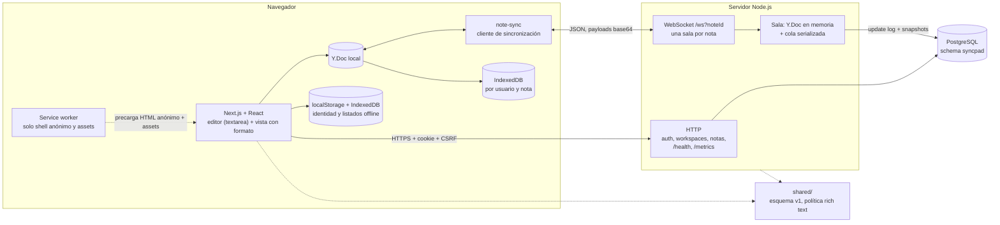
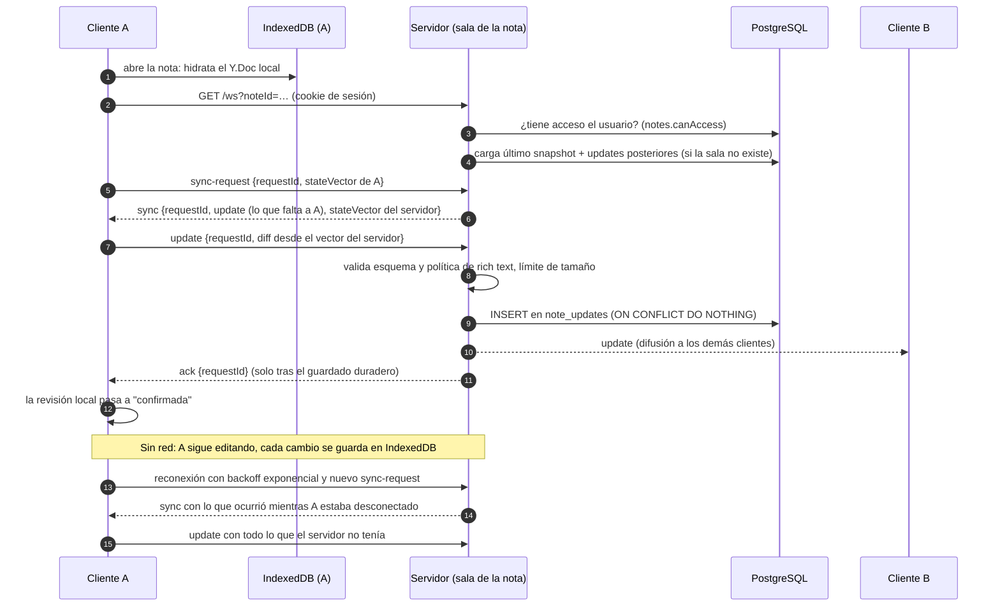

# Arquitectura de SyncPad

SyncPad es un editor de notas colaborativo con modo offline. Varios clientes
editan la misma nota a la vez, cada cambio se guarda en el dispositivo y en el
servidor, y todas las réplicas convergen al mismo texto aunque alguien haya
estado sin red.

Este documento describe lo implementado y verificable en el código. Lo que
depende del despliegue real está marcado como **pendiente de publicar** (ver [Despliegue y demo pública](#despliegue-y-demo-pública)); lo que no se
ha podido comprobar se declara en [Límites conocidos](#límites-conocidos). El
detalle de cada pieza está en el [índice de documentos por issue](issues/README.md).
Para ver el producto en funcionamiento, el [guion de demo](demo-script.md).

## Componentes

Monorepo npm con cuatro paquetes (no hay `package.json` en la raíz):

| Carpeta | Contenido |
| --- | --- |
| `frontend/` | Next.js + React. Una sola página (`/`), editor sobre un `<textarea>`, cliente de sincronización, persistencia local y service worker. |
| `backend/` | Servidor Node.js (HTTP + WebSocket con `ws`) y migraciones SQL sobre PostgreSQL. |
| `shared/` | Contratos y reglas comunes: esquema de documento v1, versión del protocolo, política de rich text. |
| `e2e/` | Pruebas Playwright (Chromium) contra el frontend y el backend reales. |



El servidor es la fuente de autoridad de permisos y del registro de cambios; el
cliente es la fuente de autoridad de sus propias ediciones hasta que el servidor
las confirma. No hay fusión a nivel de aplicación: la fusión la hace el CRDT
(Yjs) en ambos lados.

## Flujo de sincronización

Cada nota es un documento Yjs con esquema versionado
([#18](issues/018-yjs-schema.md), [#35](issues/035-schema-versions.md)). El
cliente y el servidor intercambian solo lo que le falta al otro, medido con el
vector de estado de Yjs ([#20](issues/020-yjs-sync.md),
[#28](issues/028-reconnection.md)).



Puntos que conviene conocer
(`frontend/src/lib/note-sync.ts`, `backend/src/server.ts`):

- **Orden del servidor al recibir un `update`**: validar con un documento de
  prueba (esquema y política de rich text), comprobar el tamaño, añadir al
  registro (`syncStore.append`), aplicarlo a la sala, difundirlo y solo entonces
  enviar `ack`. Si el guardado falla, no hay `ack` y el cliente sigue
  considerando el cambio pendiente. Sin `syncStore` configurado, el servidor
  responde `persistence-unavailable` (no reintentable).
- **Idempotencia**: enviar dos veces el mismo update no duplica nada. La tabla
  `note_updates` tiene `UNIQUE (note_id, update_hash)` y el cliente siempre
  sube la diferencia respecto al vector del servidor.
- **Estado visible**: `offline`, `reconnecting`, `syncing` y `up-to-date`
  ([#29](issues/029-sync-status.md)). «Guardado» significa que llegó el `ack`
  correspondiente y que la revisión local no ha avanzado desde entonces.
- **Reconexión**: espera exponencial de 500 ms hasta 10 s. Antes de dar por
  desconectado, el cliente sondea (`probe`) si la nota sigue existiendo, para
  distinguir «sin red» de «nota eliminada» ([#34](issues/034-delete-while-offline.md)).
- **Estados terminales**: nota eliminada (cierre 4404) y esquema incompatible.
  En ambos la copia local se conserva intacta y se puede descargar como `.txt`.
- **Una sala por nota**: un `Y.Doc` en memoria con una cola que serializa los
  updates. Se carga a demanda desde el último snapshot más los updates
  posteriores, y se retira cuando se borra la nota.

### Modelo de documento y reglas de fusión

- `Y.Map` `note` con `schemaVersion` (v1) y `Y.Text` `content`. El arranque
  escribe `schemaVersion` con el `clientID` 0, de modo que todas las réplicas
  crean exactamente el mismo item de Yjs.
- Dos clientes que reemplazan la misma palabra a la vez **conservan ambas
  versiones** (por ejemplo `perroloro`); no hay «último gana». Una eliminación
  es definitiva. El deshacer solo afecta a las ediciones del propio usuario
  ([#36](issues/036-scoped-undo.md), [#38](issues/038-merge-rules.md)).
- Rich text acotado ([#39](issues/039-rich-text.md)): atributos de texto de
  Yjs `bold` y `link`; las listas son líneas que empiezan por `- `. No se
  genera HTML: la vista usa elementos de React.

## Modelo de datos

PostgreSQL, schema `syncpad`, migraciones `001`–`008` en `backend/migrations/`
([#4](issues/004-migrations.md)).

| Tabla | Contenido y restricciones |
| --- | --- |
| `users` | Email único sin distinguir mayúsculas (índice sobre `lower(email)`) y `password_hash`. |
| `sessions` | `token_hash` único (SHA-256 en base64url, nunca el token), `expires_at`, `revoked_at`. |
| `workspaces` | Nombre de 1 a 120 caracteres. |
| `memberships` | Clave primaria (`workspace_id`, `user_id`); rol `OWNER` o `MEMBER`. |
| `invitations` | `token_hash` único, caducidad por defecto de 7 días, `accepted_at`; índice único parcial para una sola invitación pendiente por workspace y email. |
| `notes` | Título de 1 a 200 caracteres, `workspace_id`, `created_by`. |
| `note_updates` | Registro de cambios Yjs: `id` bigserial, `update_hash` (sha256), `update_data` (bytea), `UNIQUE (note_id, update_hash)`. |
| `note_snapshots` | Un snapshot por nota: `covers_update_id`, `state`, `update_count`. |

Principios:

- **El registro de updates es la fuente de verdad.** Los snapshots solo
  aceleran la carga ([#44](issues/044-snapshots.md)): uno cada 100 updates
  (`DEFAULT_SNAPSHOT_EVERY`) y al cargar por primera vez una historia larga. Si
  un snapshot falla, no se pierde nada (es de mejor esfuerzo).
- **Compactación** ([#45](issues/045-compaction.md)): se borran los updates
  cubiertos por el snapshot una vez superada la ventana de retención (7 días por
  defecto, `SYNC_RETENTION_HOURS`).
- **Persistencia en el cliente**: IndexedDB por usuario y nota
  ([#25](issues/025-indexeddb.md)); la identidad y los listados offline
  ([#30](issues/030-offline-navigation.md)) se guardan en `localStorage`
  (`syncpad.offline-identity.v1`) e IndexedDB.

## Interfaz HTTP

Cookie de sesión `syncpad_session` (HttpOnly) y cabecera `x-csrf-token` en las
mutaciones (ver [Seguridad](#seguridad)).

| Área | Rutas |
| --- | --- |
| Autenticación ([#9](issues/009-auth-api.md)) | `POST /auth/register` (201), `POST /auth/login`, `GET /auth/me`, `POST /auth/logout`, `GET /auth/csrf` |
| Workspaces ([#12](issues/012-workspace-api.md)) | `GET` y `POST /workspaces`, `GET /workspaces/:id` |
| Invitaciones y miembros ([#13](issues/013-member-invitations.md)) | `GET` y `POST /workspaces/:id/invitations`, `DELETE /workspaces/:id/invitations/:invId`, `GET /workspaces/:id/members`, `DELETE /workspaces/:id/members/:userId`, `POST /invitations/:token/accept` |
| Notas ([#15](issues/015-note-crud.md)) | `GET` y `POST /workspaces/:id/notes`, `PATCH` y `DELETE /notes/:id` |
| Operación | `GET /health`; `GET /metrics` solo con `Authorization: Bearer <METRICS_TOKEN>` (sin token configurado o con uno incorrecto responde 404) |
| Tiempo real | `GET /ws?noteId=<uuid>` (upgrade a WebSocket) |

## Protocolo WebSocket

Mensajes JSON; los updates y vectores de estado viajan en base64.
`SYNC_PROTOCOL_VERSION = 1` (`shared/`).

| Dirección | Mensaje | Campos |
| --- | --- | --- |
| Cliente → servidor | `sync-request` | `requestId?`, `stateVector?` |
| Cliente → servidor | `update` | `requestId?`, `update` |
| Cliente → servidor | `awareness` | `cursor?`: `{anchor, head}` o `null` |
| Servidor → cliente | `sync` | `requestId?`, `update`, `stateVector` |
| Servidor → cliente | `update` | cambios de otros clientes |
| Servidor → cliente | `ack` | `requestId` (tras el guardado duradero) |
| Servidor → cliente | `awareness` | `users`, `self` (presencia y cursores, efímeros, no se guardan) |
| Servidor → cliente | `sync-error` | `requestId?`, `code`, `retryable` |

Códigos de `sync-error`: `persistence-unavailable`, `invalid-message`,
`note-deleted`, `incompatible-schema`, `rate-limited`, `note-too-large`,
`room-full`, `access-revoked`.

Códigos de cierre:

| Código | Motivo |
| --- | --- |
| 4404 | La nota se eliminó |
| 4403 | Acceso revocado |
| 1008 | Límite de ritmo superado, o falta `noteId` |
| 1003 | Mensaje inválido o esquema incompatible |
| 1009 | Trama demasiado grande |
| 1011 | Almacenamiento o comprobación de acceso no disponible |
| 1013 | Sala llena |
| 1001 | Apagado del servidor |

La presencia ([#23](issues/023-awareness.md), [#40](issues/040-participants-cursors.md))
es efímera: solo se difunde entre los conectados y nunca llega a PostgreSQL.

## Seguridad

Cada punto indica dónde está implementado y qué issue lo documenta.

**Cuentas y sesiones** ([#8](issues/008-users-sessions.md),
[#9](issues/009-auth-api.md), [#10](issues/010-security-policy.md))

- Las contraseñas se guardan con `scrypt` (N=16384, r=8, p=1, clave de 64
  bytes, sal aleatoria de 16 bytes) y se comparan con `timingSafeEqual`. El
  único requisito de contraseña que impone el servidor es una longitud mínima
  de 8 caracteres.
- El token de sesión es aleatorio y la base de datos solo guarda su hash
  SHA-256. La sesión dura 30 días y se puede revocar (logout).
- La cookie `syncpad_session` es `HttpOnly`, `Path=/` y con `SameSite`
  configurable (`Lax`, `Strict` o `None`; `None` exige `COOKIE_SECURE=true`).
  `Secure` es `true` por defecto con `NODE_ENV=production`.

**CSRF y CORS**

- CSRF por doble envío: `GET /auth/csrf` fija la cookie `syncpad_csrf`
  (legible por JavaScript) y devuelve el token; toda mutación debe enviarlo en
  `x-csrf-token` y coincidir con la cookie (comparación en tiempo constante).
- CORS con un único origen permitido (`CORS_ORIGIN`) y credenciales. Otros
  orígenes reciben 403 `ORIGIN_NOT_ALLOWED`.

**Autorización**

- Todo acceso a workspaces y notas comprueba la pertenencia del usuario
  ([#17](issues/017-isolation-tests.md)).
- En el upgrade del WebSocket se valida la cookie y `notes.canAccess`, con 401 o
  403 si falla ([#19](issues/019-websocket-authorization.md)).
- Una conexión abierta no conserva el permiso para siempre: se recomprueba con un
  temporizador, antes de tratar un mensaje cuando ha pasado
  `SYNC_PERMISSION_RECHECK_MS` (5 s por defecto) y ante eventos (logout,
  expulsión de un miembro). Al perder el acceso se envía `access-revoked` y se
  cierra con 4403 ([#51](issues/051-ws-permissions.md)).

**Entrada no confiable** ([#53](issues/053-malformed-payloads.md),
[#54](issues/054-sanitize-rich-text.md))

- Cada update se aplica primero a un documento de prueba: se rechazan esquema
  incorrecto, marcas no permitidas y embeds. Solo se permiten los atributos
  `bold` y `link`; un enlace debe ser `http`, `https` o `mailto`, sin
  credenciales y de hasta 2048 caracteres (`shared/src/rich-text-policy.ts`).
- El cliente no genera HTML a partir del contenido ([#39](issues/039-rich-text.md)).

**Límites de carga** ([#47](issues/047-reconnect-bursts.md), [#48](issues/048-limits.md)).
Todos se pueden cambiar con variables de entorno:

| Límite | Valor por defecto | Variable |
| --- | --- | --- |
| Latido (heartbeat) | 30 000 ms | `SYNC_HEARTBEAT_MS` |
| Mensajes por segundo | 100 | `SYNC_MESSAGES_PER_SECOND` |
| Ráfaga | 200 | `SYNC_MESSAGE_BURST` |
| Awareness por segundo | 20 | `SYNC_AWARENESS_PER_SECOND` |
| Tamaño máximo de mensaje WebSocket | 1 MiB | `SYNC_MAX_MESSAGE_BYTES` |
| Caracteres máximos por nota | 500 000 | `SYNC_MAX_NOTE_CHARS` |
| Clientes por sala | 50 | `SYNC_MAX_CLIENTS_PER_ROOM` |
| Recomprobación de permisos | 5000 ms | `SYNC_PERMISSION_RECHECK_MS` |

Se usa un cubo de fichas (token bucket). Un exceso de awareness se descarta sin
cortar el socket; un exceso de mensajes cierra la conexión con `rate-limited`.
Una nota por encima del límite de tamaño solo se rechaza si el cambio la haría
crecer.

**Aislamiento de datos en el cliente** ([#52](issues/052-data-isolation.md))

- IndexedDB, identidad y listados se separan por usuario. Al cerrar sesión se
  limpia la interfaz y se cierra el socket, pero los datos locales **se
  conservan** (sin cifrar) bajo la clave del usuario. No se muestran a otra
  cuenta, y reaparecen si la misma cuenta vuelve a entrar.
- El service worker **nunca** guarda respuestas privadas: solo el HTML anónimo y
  los assets estáticos del build ([#26](issues/026-app-shell.md)).

**Observabilidad sin datos privados** ([#49](issues/049-observability.md)):
logs JSON y métricas Prometheus (`syncpad_connections_current`,
`syncpad_rooms_current`, `syncpad_updates_total{outcome}`,
`syncpad_update_persist_ms`, `syncpad_sync_errors_total{code}`,
`syncpad_limit_hits_total{limit}`, entre otras) sin ids de nota o usuario como
etiquetas ni contenido, emails o cookies en los logs.

## Decisiones

| Decisión | Motivo | Documento |
| --- | --- | --- |
| Yjs (CRDT) en lugar de transformación operacional o «último gana» | Fusión sin servidor central de orden; ediciones offline que convergen y conservan el trabajo de todos | [#32](issues/032-concurrent-edits.md), [#33](issues/033-divergent-branches.md), [#38](issues/038-merge-rules.md) |
| Sincronización por diferencia de vector de estado, con `requestId` y `ack` | Reconexiones baratas e idempotentes; «guardado» significa realmente guardado | [#28](issues/028-reconnection.md) |
| Registro de updates + snapshots, con el registro como fuente de verdad | Cargas rápidas sin que un snapshot fallido pueda perder datos | [#21](issues/021-yjs-persistence.md), [#44](issues/044-snapshots.md), [#45](issues/045-compaction.md) |
| Esquema de documento versionado; cambios aditivos no suben versión | Clientes viejos y nuevos conviven; los incompatibles se detienen sin tocar la copia local | [#35](issues/035-schema-versions.md) |
| IndexedDB nativo en lugar de `y-indexeddb` | Errores de apertura y lectura manejables y sin promesas colgadas | [#25](issues/025-indexeddb.md) |
| Service worker solo para el shell anónimo | El caché del navegador no puede filtrar datos de una cuenta | [#26](issues/026-app-shell.md) |
| Datos locales conservados tras el logout, sin cifrar | Permiten recuperar trabajo sin conexión; la separación por usuario evita mezclas en la app (no protege frente a quien tenga el perfil del navegador) | [#52](issues/052-data-isolation.md) |
| Rich text como atributos de texto de Yjs, no un árbol ProseMirror | Evita subir el esquema a v2 y rehacer undo y persistencia | [#39](issues/039-rich-text.md) |
| Deshacer acotado a las ediciones propias | Un usuario no deshace el trabajo de otro | [#36](issues/036-scoped-undo.md) |

## Límites conocidos

- **Sin cifrado en reposo** ni borrado de datos locales al cerrar sesión
  ([#25](issues/025-indexeddb.md), [#52](issues/052-data-isolation.md)).
- **El registro de IndexedDB crece sin compactación** en el cliente
  ([#25](issues/025-indexeddb.md)); si falla una escritura local, no se
  reintenta.
- **Offline acotado**: el service worker cubre `/` y los assets estáticos. La
  primera visita siempre necesita red, y sin HTTPS (salvo localhost) o sin
  Service Worker no hay apertura offline ([#26](issues/026-app-shell.md)).
- **Un solo `Y.Text`**: no hay formato por bloques (títulos, tablas); añadirlo
  exigiría subir el esquema a v2 ([#39](issues/039-rich-text.md)).
- **Rendimiento con muchos editores**: en el benchmark local con almacén en
  memoria, 1 editor × 50 ediciones cumple el presupuesto de 250 ms (p95 ≈ 240
  ms), pero las configuraciones de 5 y 10 editores lo superan. Se midió en un
  Apple M4 Pro; no hay medición contra PostgreSQL en hosting
  ([#50](issues/050-benchmark.md)).
- **Una instancia del servidor**: las salas viven en memoria de un proceso, por
  lo que no hay escalado horizontal ni difusión entre instancias. Las métricas
  y los límites son por proceso. No hay una prueba que lo verifique con varias
  instancias.
- **Cabeceras de seguridad HTTP** (CSP, `X-Content-Type-Options`, etc.): no se
  encontraron configuradas ni en `backend/src` ni en `frontend/next.config.ts`;
  pueden añadirse en el Caddyfile de `deploy/` (no se han añadido).
- **Política de contraseñas mínima** (8 caracteres). No se ha verificado para
  este documento que exista limitación de intentos en el login.
- **Un solo origen CORS** y cookies de sesión compartidas entre frontend y
  backend: el despliegue gratuito lo resuelve sirviendo web, API y `/ws` desde un único
  origen (`SameSite=Lax`, `Secure`; ver [deployment.md](deployment.md)).
- **Documentación por issue** ([#57 en adelante](issues/README.md)) pendiente de
  añadir al índice.
- La nota «límite conocido» sobre la recomprobación de permisos WebSocket que
  aparece en [#38](issues/038-merge-rules.md) está desactualizada: se resolvió en
  [#51](issues/051-ws-permissions.md).

## Desarrollo local

Puertos por defecto (`.env.example`): frontend 3000, backend 3001, PostgreSQL
5432.

```bash
cp .env.example .env              # ajusta variables si hace falta
scripts/start-backend-local.sh    # levanta Postgres (docker compose), migra y arranca el backend
npm --prefix frontend run dev     # frontend en http://localhost:3000
```

`scripts/start-backend-local.sh` ejecuta `docker compose up -d --wait postgres`,
`npm --prefix backend run migrate` y `npm --prefix backend run dev`.

## Pruebas

| Qué | Comando | Requisitos |
| --- | --- | --- |
| Comprobación completa | `scripts/check.sh`: tests, lint, typecheck y build del backend; tests de `shared/`; tests, lint y typecheck del frontend | Dependencias instaladas y PostgreSQL para las pruebas del backend |
| Frontend | `cd frontend && npx tsx --test tests/*.test.tsx` | `npm ci` en `frontend/` y en `backend/` (una prueba usa `ws`); sin red ni PostgreSQL |
| Compartido | `cd backend && npx tsx --test ../shared/src/*.test.ts` | `npm ci` en `backend/` |
| Backend | `cd backend && npm test` | PostgreSQL |
| End-to-end | Playwright con proyecto Chromium (`e2e/`); frontend en el puerto 4000, backend en el 4001, PostgreSQL en el 55432 por defecto; un solo worker | PostgreSQL y Chromium |

Pruebas del servidor destacadas, por tema: sincronización (`ws-sync`,
`ws-reconnection`, `restart-convergence`), seguridad (`ws-auth`,
`ws-permissions`, `ws-isolation`, `ws-malformed`, `access-isolation`), límites
(`ws-limits`, `ws-bursts`), ciclo de vida (`ws-note-deletion`,
`ws-schema-compat`, `ws-snapshots`), `ws-awareness`, `sync-store` y
`observability`.

## Despliegue y demo pública

Decisión (#64), detalle y cuotas en [deployment.md](deployment.md):

- **Topología**: un servicio Docker gratuito de Render con tres procesos (servidor de
  sincronización, Next.js y Caddy) detrás de un único puerto, y PostgreSQL en Neon.
  Render termina TLS, así que el navegador ve un solo origen HTTPS/WSS.
- **Cookies y CORS**: al ser primera parte, `SameSite=Lax` + `Secure`; `CORS_ORIGIN` es la
  URL pública (se deduce de `RENDER_EXTERNAL_URL`). El cliente usa URLs relativas cuando
  `NEXT_PUBLIC_API_URL` y `NEXT_PUBLIC_WS_URL` van vacíos (#65).
- **Secretos**: solo `DATABASE_URL` y `METRICS_TOKEN`, en el panel del hosting;
  `scripts/check-secrets.sh` lo vigila en Git y en las imágenes.
- **Copias**: `scripts/backup.sh` y `restore.sh`, probados con una nota real (#66).
- **Humo posterior**: `scripts/smoke-public.mts <url>` (#68).

**Desplegado** el 2026-10-07 en https://syncpad-0xyk.onrender.com; el humo público pasó 10 de 10 (detalle y lo que sigue
sin medir en [deployment.md](deployment.md)). **Pendiente**: la release v1.0.0 (#69).
