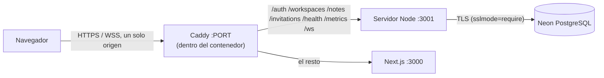

# Despliegue

Cómo se publica SyncPad con coste de 0 €, qué límites impone ese hosting y cómo se
recupera. Es un despliegue de **exposición**, no de producción: la sección
[Límites de un solo nodo](#límites-de-un-solo-nodo) dice exactamente qué no promete.

> Este documento se amplía issue a issue (#64 → #68). Lo que aún no está hecho se
> marca como pendiente en la sección correspondiente.

## Decisión de hosting (#64)

| Pieza | Servicio | Plan | Coste |
| --- | --- | --- | --- |
| Web + API + WebSocket | [Render](https://render.com/docs/free), un único *web service* Docker | Free | 0 € |
| PostgreSQL | [Neon](https://neon.com/pricing) | Free | 0 € |
| Código y CI | GitHub / GitHub Actions | Free | 0 € |

Se descartaron:

- **Vercel (web) + Render (API)**: son dominios distintos y ambos están en la lista de
  sufijos públicos, así que la sesión sería una cookie de terceros (`SameSite=None`).
  Safari y los modos de privacidad la bloquean, y la demo fallaría justo en lo que
  se quiere enseñar.
- **Serverless para el WebSocket**: las salas viven en memoria de un proceso largo; una
  función efímera no puede sostenerlas.
- **PostgreSQL de Render gratuito**: caduca; Neon no.

### Topología



Un solo origen hace que la cookie de sesión sea de primera parte (`SameSite=Lax`,
`Secure`), que el WebSocket no necesite una configuración de CORS especial y que
`NEXT_PUBLIC_API_URL` pueda ir vacío (URLs relativas). Las variables están en la sección
siguiente; el contenedor combinado está descrito en [Contenedor y blueprint](#contenedor-y-blueprint-67).

## Costes y cuotas

Cifras de la documentación de los proveedores consultadas el 2026-10-07; pueden cambiar.

| Recurso | Límite del plan gratuito | Efecto en SyncPad |
| --- | --- | --- |
| Render, horas | 750 h de instancia gratuita al mes por cuenta | Una instancia 24 h cabe (≈ 744 h); con más servicios gratuitos se agotaría |
| Render, inactividad | Se duerme tras 15 min sin tráfico HTTP **ni mensajes WebSocket** entrantes | La primera visita tras una pausa tarda ≈ 1 min en despertar |
| Neon, almacenamiento | 0,5 GB por proyecto | Texto plano y updates de Yjs: de sobra para una demo; el límite lo marca el registro de updates entre compactaciones |
| Neon, cómputo | 100 CU-h al mes; se suspende a los 5 min sin conexiones | La primera consulta tras suspender añade latencia de arranque |
| Neon, restauración | Ventana de 6 h (hasta 1 GB de cambios) | No sustituye a una copia: ver plan de copias |

La memoria del plan gratuito de Render no se ha verificado: en local el contenedor usa
~83 MiB en reposo, y la medición sobre la URL real queda para el humo de #68.

## Límites de un solo nodo

- **Una instancia del servidor**: las salas están en memoria, así que no se puede
  escalar horizontalmente ni hay alta disponibilidad. No se promete ninguna.
- **Se duerme**: al despertar se pierden las salas en memoria, pero no los datos; los
  clientes reconectan, piden `sync-request` y fusionan lo que tenían sin conexión.
- **Despliegues y reinicios cortan los WebSockets** (cierre 1001); el cliente reintenta
  y reenvía lo pendiente desde IndexedDB.
- **Conexiones de base de datos**: Neon las cierra al suspender el cómputo. El pool las
  descarta y abre otras bajo demanda; `createDatabasePool` registra el aviso en lugar
  de caerse (#64, `backend/tests/database.test.ts`).
- **Rendimiento**: el [benchmark #50](issues/050-benchmark.md) se midió sin red ni
  PostgreSQL remoto; en este hosting será peor. La demo es para dos o tres personas.

## HTTPS, WSS, cookies y secretos (#65)

**TLS lo termina Render.** El navegador habla `https://` y `wss://` con la plataforma, y
dentro del contenedor el tráfico va en claro por `127.0.0.1` (Caddy con `auto_https off`
escuchando en `$PORT`). Como la web, la API y `/ws` comparten origen, no hay certificados
ni dominios que gestionar.

El navegador llega a `wss://` sin configuración: con `NEXT_PUBLIC_WS_URL` vacío el cliente
usa el esquema de la página (`https:` → `wss:`) y su `host`
(`frontend/src/lib/endpoints.ts`); con `NEXT_PUBLIC_API_URL` vacío las peticiones son
relativas.

| Variable | Valor en producción | Tipo | Notas |
| --- | --- | --- | --- |
| `NEXT_PUBLIC_API_URL`, `NEXT_PUBLIC_WS_URL` | vacías | argumento de build, público | un origen; se incrustan en el bundle |
| `CORS_ORIGIN` | `https://<servicio>.onrender.com` | configuración | origen exacto de la web; también lo exige el WebSocket (`403` si el `Origin` no coincide). El contenedor la deriva de `RENDER_EXTERNAL_URL` si no se define (#67) |
| `COOKIE_SECURE` | `true` | configuración | la cookie de sesión y la de CSRF solo viajan por HTTPS |
| `COOKIE_SAME_SITE` | `Lax` | configuración | primera parte: no hace falta `None` |
| `DATABASE_URL` | cadena de conexión **directa** de Neon con `?sslmode=require` | **secreto** | el pool es persistente, así que no se usa el *pooler* |
| `METRICS_TOKEN` | cadena aleatoria (`openssl rand -base64 32`) | **secreto** | sin ella `/metrics` responde 404 |
| `SYNCPAD_RUN_MIGRATIONS` | `true` | configuración | el entrypoint migra antes de escuchar |

### Dónde viven los secretos

- **En el panel de Render**, como variables de entorno (`sync: false` en el *blueprint*,
  así el valor no se escribe en `render.yaml`). Nunca en Git ni en un `ARG`/`ENV` del
  Dockerfile.
- `.gitignore` excluye `.env` y `.env.*` (salvo `.env.example`) y `.dockerignore` los deja
  fuera de la imagen.
- **Se comprueba**: `sh scripts/check-secrets.sh [IMAGEN…]` falla si hay un fichero de
  entorno versionado, una URL de base de datos con contraseña y host remoto, una clave
  privada o un token con aspecto de tal, una variable secreta con valor literal, y, para
  cada imagen, secretos en `ENV`, ficheros `.env*` o URLs con credenciales en el historial
  de capas. Lo ejecutan `scripts/check.sh` y CI (`backend.yml`, en `checks` sobre los
  ficheros y en `image` sobre la imagen).
- Si un secreto se filtrase, se rota (nueva contraseña en Neon, nuevo `METRICS_TOKEN`) y se
  reinicia el servicio; borrar el commit no basta.

## Plan de copias y restauración de notas

La fuente de verdad es PostgreSQL (`syncpad.note_updates` y `syncpad.note_snapshots`;
ver [architecture.md](architecture.md)). Plan:

1. **Qué se copia**: volcado lógico con `pg_dump` del esquema `syncpad` (cuentas,
   workspaces, notas, registro de updates y snapshots) y del libro de migraciones
   `public.schema_migrations`.
2. **Cuándo**: manualmente antes de cada despliegue que toque migraciones y una vez por
   semana mientras la demo esté activa. Un volcado de una demo pesa kilobytes.
3. **Dónde**: fuera del repositorio y de la imagen (contiene datos de personas y hashes
   de contraseñas). Nunca en Git.
4. **Restauración**: a una base **vacía** con `psql` (`restore.sh` se niega si ya existe
   el esquema `syncpad`), y después se comprueba una nota concreta. La ventana de 6 h de Neon es un segundo recurso para errores recientes,
   no la copia.
5. **Qué se acepta perder**: lo escrito desde el último volcado. Los clientes con
   cambios locales los reenviarán al reconectar, porque Yjs fusiona el estado que
   falta; por eso restaurar es seguro para ediciones que aún estén en un navegador.

### Uso

```sh
DATABASE_URL='postgresql://…@…neon.tech/neondb?sslmode=require' sh scripts/backup.sh
# → backups/syncpad-20261007T120000Z.sql (ignorada por Git y por la imagen, permisos 600)

# Restaurar: crear antes una base vacía (en Neon, una rama o una base nueva)
DATABASE_URL='<url de la base vacía>' sh scripts/restore.sh backups/syncpad-….sql
```

- Los scripts no necesitan `pg_dump` ni `psql` en el equipo: lanzan un contenedor
  `postgres:<versión mayor del servidor>-alpine` (hace falta Docker). `PG_IMAGE` fuerza otra
  imagen. Un volcado debe restaurarse en un servidor de la misma versión mayor o superior.
- `backup.sh` escribe en un fichero `.partial` y solo lo renombra si el volcado termina con
  la marca de «dump complete»; un volcado cortado no pasa por bueno.
- Tras restaurar, el script imprime el recuento de notas, updates y snapshots. El servicio
  se apunta a la base restaurada cambiando `DATABASE_URL` en Render y reiniciando.
- **Verificado** por `backend/integration/backup-restore.int.test.ts`: crea una cuenta, una
  nota con dos updates y un snapshot, hace el volcado, lo restaura en una base nueva, abre
  un servidor sobre ella y comprueba que el texto y el historial siguen ahí; y que un
  fichero que no es un volcado se rechaza sin tocar la base.
- **Alta de Neon (manual)**: crear cuenta gratuita en neon.com, un proyecto en la región
  más cercana a la de Render, copiar la cadena de conexión **directa** (no la del pooler)
  con `sslmode=require` y guardarla solo como variable `DATABASE_URL` del servicio.


## Contenedor y blueprint (#67)

- **`deploy/Dockerfile`**: una sola imagen (~99 MB) con el servidor de sincronización, Next.js
  (`standalone`, compilado con `NEXT_PUBLIC_*` vacíos: el bundle no contiene ningún host) y
  Caddy copiado de `caddy:2-alpine`.
- **`deploy/supervisor.mjs`** (PID 1): exige `DATABASE_URL` y una URL pública, aplica las
  migraciones, arranca backend (`127.0.0.1:3001`), web (`127.0.0.1:3000`) y Caddy (`$PORT`).
  Si cualquiera muere, el contenedor termina para que Render lo reinicie; `SIGTERM` se
  reenvía y los WebSockets se cierran con 1001.
- **`deploy/Caddyfile`**: `auto_https off` (Render ya termina TLS); `/auth`, `/workspaces`,
  `/notes`, `/invitations`, `/health`, `/metrics` y `/ws` van al backend; el resto, a Next.js.
- **`render.yaml`**: servicio `docker` en plan `free`, `healthCheckPath: /health`,
  `DATABASE_URL` como `sync: false` (se escribe en el panel) y `METRICS_TOKEN` generado por
  Render. `CORS_ORIGIN` se deduce de `RENDER_EXTERNAL_URL`; define `CORS_ORIGIN` solo si
  usas un dominio propio.

### Pasos manuales para desplegar

1. **Neon**: crear el proyecto y copiar la cadena directa (ver arriba).
2. **Render**: *New → Blueprint*, elegir este repositorio y la rama a desplegar
   (`render.yaml` en la raíz), y pegar `DATABASE_URL` cuando lo pida.
3. Esperar al primer despliegue (compila las dos aplicaciones; varios minutos) y abrir la
   URL `https://<nombre>.onrender.com`.
4. Ejecutar el [humo posterior al despliegue](#humo-posterior-al-despliegue-68) contra esa URL.

### Verificado en local (2026-10-07)

Con Docker y PostgreSQL 16 local, sin Render: la imagen compila, queda `healthy` en ~8 s,
sirve la web y `/health` por el mismo puerto, el humo de dos clientes
(`scripts/smoke-stack.mts`) pasa **a través de Caddy** (edición de A recibida por B tras el
`ack`), un `Origin` ajeno recibe 403 en `/ws`, y `docker stop` cierra el WebSocket con 1001
y sale con código 0. Memoria en reposo: ~83 MiB (no se ha medido bajo carga ni en Render).

### Primer despliegue real (2026-10-07)

Las migraciones se aplicaron en Neon (8), pero Caddy no arrancó: `spawn EPERM`. El binario
oficial lleva la capability de fichero `cap_net_bind_service` y Render ejecuta sin ella. Se
quita en `deploy/Dockerfile` (el puerto es 10000), y CI arranca ahora el contenedor con
`--cap-drop=ALL --security-opt no-new-privileges` para que no vuelva a pasar. El aviso de `pg`
sobre `sslmode=require` es solo informativo: ya lo trata como `verify-full`, que Neon cumple.

### No verificado hasta desplegar

- Que Render defina `RENDER_EXTERNAL_URL` con la URL `https` pública (si no, definir
  `CORS_ORIGIN`).
- Cookie `Secure` y WSS sobre el dominio real, y el comportamiento al despertar del sueño
  (~1 min de arranque en frío): lo cubre el humo de #68.
- Cuotas de RAM y CPU del plan gratuito.

## Humo posterior al despliegue (#68)

```sh
cd backend && npx tsx ../scripts/smoke-public.mts https://<servicio>.onrender.com
```

Despierta el servicio si duerme (hasta 150 s y avisa del arranque en frío) y comprueba, con
una cuenta nueva `smoke-<uuid>@example.test`: `/health` y la web en el mismo origen; cookie de
sesión `HttpOnly`, `SameSite=Lax` y `Secure`; conexión `wss://`; edición con `ack` que llega a
un segundo navegador; el texto sigue ahí tras cerrar todos los sockets y entrar con un
navegador nuevo; y un `Origin` ajeno recibe 403. Sale con código 1 si falla algo. Deja una
cuenta, un workspace y una nota de prueba en la base: se pueden borrar desde la propia app.

Ensayado en local contra la imagen de `deploy/Dockerfile` (10 comprobaciones en verde) y con
`COOKIE_SECURE=false` (falla la comprobación `Secure`, como debe). Sobre la URL real aún no se
ha ejecutado.

## Operación y recuperación (#68)

| Síntoma | Causa probable | Qué hacer |
| --- | --- | --- |
| La primera carga tarda ~1 min | El servicio gratuito dormía | Esperar; el humo lo mide. No es un fallo |
| `/health` responde pero guardar falla («Pendiente» permanente) | Neon suspendido o con la cuota agotada | Reintentar a los segundos; si persiste, revisar el panel de Neon (CU-h del mes) |
| 403 al conectar o al hacer POST | `CORS_ORIGIN` distinto de la URL real (dominio propio, `www`) | Definir `CORS_ORIGIN` con el origen exacto y reiniciar |
| El servicio no arranca: «Migrations failed» | Migración nueva con error o `DATABASE_URL` incorrecta | Ver los logs de Render; corregir y redesplegar. Una migración fallida no deja la app escuchando |
| Cuentas o notas perdidas | Error humano o de datos | Restaurar (abajo) |

**Reiniciar**: *Manual Deploy → Restart service* en Render. Los clientes reconectan solos y
reenvían lo que tuvieran sin confirmar; no se pierde lo que ya tenía `ack`.

**Volver atrás un despliegue**: en Render, *Events → Rollback* al despliegue anterior. Las
migraciones de este proyecto solo añaden, así que la versión previa sigue funcionando con
el esquema nuevo; si una migración futura fuera destructiva, restaurar antes una copia.

**Restaurar datos**: 1) `sh scripts/backup.sh` de lo que quede, por si acaso; 2) crear una
base vacía en Neon (rama o base nueva); 3) `DATABASE_URL=<esa base> sh scripts/restore.sh
backups/<fichero>.sql`; 4) comprobar el recuento que imprime y abrir una nota; 5) cambiar
`DATABASE_URL` del servicio en Render y reiniciar; 6) ejecutar el humo. Para un error de las
últimas 6 h, la restauración de Neon a un punto anterior evita pasar por el volcado.

**Rotar secretos**: nueva contraseña en Neon → actualizar `DATABASE_URL` en Render →
reiniciar; `METRICS_TOKEN` se regenera borrando la variable y volviendo a sincronizar el
blueprint. Borrar el commit que lo filtró no basta.

## Pendiente
- Despliegue real, URL pública y release `v1.0.0`: #69 (requiere las cuentas de Render y Neon).
