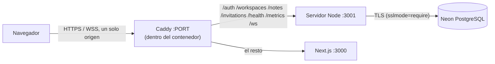

# Despliegue

Cómo se publica SyncPad con coste de 0 €, qué límites impone ese hosting y cómo se
recupera. Es un despliegue de **exposición**, no de producción: la sección
[Límites de un solo nodo](#límites-de-un-solo-nodo) dice exactamente qué no promete.

> Este documento se amplía issue a issue (#64 → #68). Lo que aún no está hecho se
> marca como pendiente en la sección correspondiente.

## Decisión de hosting (#64)

| Pieza | Servicio | Plan | Coste |
| --- | --- | --- | --- |
| Web + API + WebSocket | [Render](https://render.com/docs/free), un único *web service* Docker | Free | 0 € |
| PostgreSQL | [Neon](https://neon.com/pricing) | Free | 0 € |
| Código y CI | GitHub / GitHub Actions | Free | 0 € |

Se descartaron:

- **Vercel (web) + Render (API)**: son dominios distintos y ambos están en la lista de
  sufijos públicos, así que la sesión sería una cookie de terceros (`SameSite=None`).
  Safari y los modos de privacidad la bloquean, y la demo fallaría justo en lo que
  se quiere enseñar.
- **Serverless para el WebSocket**: las salas viven en memoria de un proceso largo; una
  función efímera no puede sostenerlas.
- **PostgreSQL de Render gratuito**: caduca; Neon no.

### Topología

Un solo origen hace que la cookie de sesión sea de primera parte (`SameSite=Lax`,
`Secure`), que el WebSocket no necesite una configuración de CORS especial y que
`NEXT_PUBLIC_API_URL` pueda ir vacío (URLs relativas). El detalle del contenedor
combinado y de las variables está en #65 y #67 (pendiente en esta rama).

## Costes y cuotas

Cifras de la documentación de los proveedores consultadas el 2026-10-07; pueden cambiar.

| Recurso | Límite del plan gratuito | Efecto en SyncPad |
| --- | --- | --- |
| Render, horas | 750 h de instancia gratuita al mes por cuenta | Una instancia 24 h cabe (≈ 744 h); con más servicios gratuitos se agotaría |
| Render, inactividad | Se duerme tras 15 min sin tráfico HTTP **ni mensajes WebSocket** entrantes | La primera visita tras una pausa tarda ≈ 1 min en despertar |
| Neon, almacenamiento | 0,5 GB por proyecto | Texto plano y updates de Yjs: de sobra para una demo; el límite lo marca el registro de updates entre compactaciones |
| Neon, cómputo | 100 CU-h al mes; se suspende a los 5 min sin conexiones | La primera consulta tras suspender añade latencia de arranque |
| Neon, restauración | Ventana de 6 h (hasta 1 GB de cambios) | No sustituye a una copia: ver plan de copias |

La memoria del plan gratuito de Render no se ha verificado aquí; se medirá en #67
con el contenedor desplegado antes de afirmar nada.

## Límites de un solo nodo

- **Una instancia del servidor**: las salas están en memoria, así que no se puede
  escalar horizontalmente ni hay alta disponibilidad. No se promete ninguna.
- **Se duerme**: al despertar se pierden las salas en memoria, pero no los datos; los
  clientes reconectan, piden `sync-request` y fusionan lo que tenían sin conexión.
- **Despliegues y reinicios cortan los WebSockets** (cierre 1001); el cliente reintenta
  y reenvía lo pendiente desde IndexedDB.
- **Conexiones de base de datos**: Neon las cierra al suspender el cómputo. El pool las
  descarta y abre otras bajo demanda; `createDatabasePool` registra el aviso en lugar
  de caerse (#64, `backend/tests/database.test.ts`).
- **Rendimiento**: el [benchmark #50](issues/050-benchmark.md) se midió sin red ni
  PostgreSQL remoto; en este hosting será peor. La demo es para dos o tres personas.

## Plan de copias y restauración de notas

La fuente de verdad es PostgreSQL (`syncpad.note_updates` y `syncpad.note_snapshots`;
ver [architecture.md](architecture.md)). Plan:

1. **Qué se copia**: volcado lógico del esquema `syncpad` con `pg_dump`, que incluye
   cuentas, workspaces, notas, registro de updates y snapshots.
2. **Cuándo**: manualmente antes de cada despliegue que toque migraciones y una vez por
   semana mientras la demo esté activa. Un volcado de una demo pesa kilobytes.
3. **Dónde**: fuera del repositorio y de la imagen (contiene datos de personas y hashes
   de contraseñas). Nunca en Git.
4. **Restauración**: a una base **vacía** con `psql`, y después se comprueba una nota
   concreta. La ventana de 6 h de Neon es un segundo recurso para errores recientes,
   no la copia.
5. **Qué se acepta perder**: lo escrito desde el último volcado. Los clientes con
   cambios locales los reenviarán al reconectar, porque Yjs fusiona el estado que
   falta; por eso restaurar es seguro para ediciones que aún estén en un navegador.

Los scripts `scripts/backup.sh` y `scripts/restore.sh` y su prueba con una nota de
ejemplo se entregan en #66.

## Pendiente

- HTTPS/WSS, cookies, CORS y secretos: #65.
- Base de datos gestionada, migraciones y copias probadas: #66.
- Configuración de despliegue y prueba con dos usuarios: #67.
- Humo posterior al despliegue y recuperación: #68.
